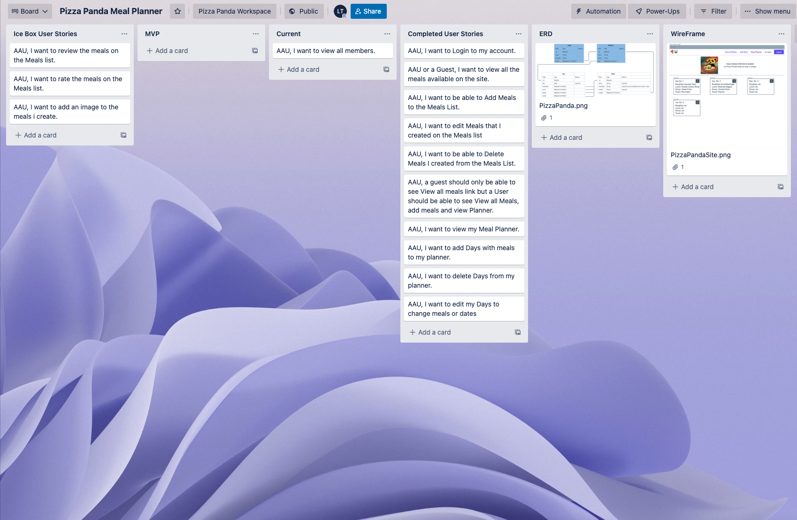
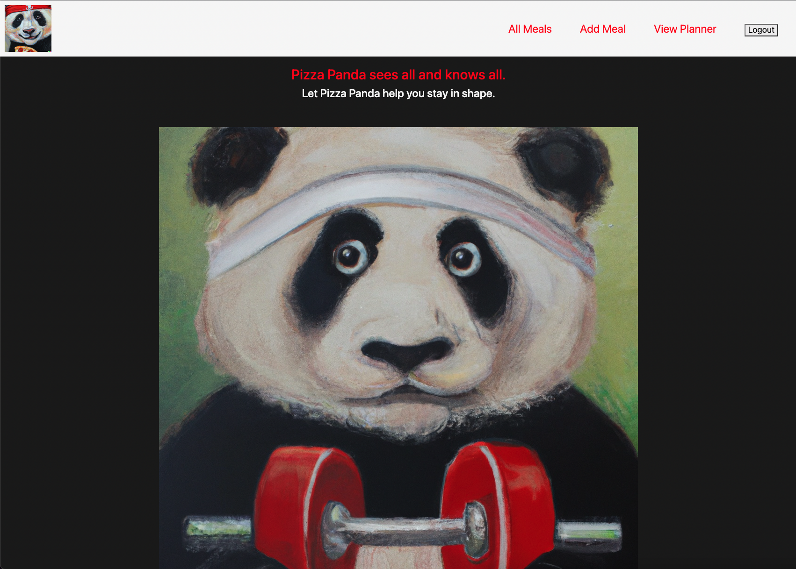

# PizzaPanda

Welcome to PizzaPanda Portion Planner, where you can contribute meals to the community and use those meals to help meal plan your days!  When I first started this project, all I had was the name (PizzaPanda, gotta love alliteration) and an AI generated image of a panda eating a pizza in the style of Vincent Van Gogh.  After a brainstorming session with my instructors, I landed on meal planning (again for the alliteration).  Thus PizzaPanda Portion Planner was born!

## Getting Started:
Thinking of meal planning?  Give **[PizzaPanda](https://pizza-panda.fly.dev/)** a try!

## Planning Material:

Trello Board

Main Page

## Technology Implemented:
1. Node.js
2. HTML
3. CSS
4. GetBootStrap.com
5. MongoDB
6. Mongoose
7. Javascript

## Credits:
**[DALL-E](https://labs.openai.com/)**   
**[DreamStudio](https://beta.dreamstudio.ai/dream)**   

## Next Steps:
1. Add reviews to meals
2. Add ratings to meals
3. Ability to Add an image to the created meals.
